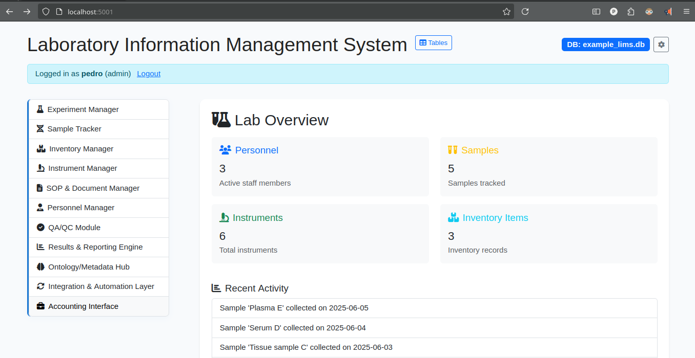

# YourLIMS: Modular, FAIR-Compliant Laboratory Information Management System



YourLIMS is a flexible, extensible Laboratory Information Management System (LIMS) built in Python with a modern web frontend. The project aims to help labs organize their data and processes using international standards, with a focus on integration and customization. While still evolving, YourLIMS is designed to be a practical starting point for FAIR-compliant, automation-ready lab management.

## Key Features

- **International Standard Schemas:**
  - Database tables are defined using JSON schemas based on international standards (MIBBI/GSC, ISA-Tab, MIxS, etc.), supporting FAIR data principles and interoperability.
- **Modular Architecture:**
  - Each major LIMS area is a separate, extensible Flask blueprint/module (Experiments, Samples, Inventory, Instruments, SOPs, Personnel, QA/QC, Results, Ontology, Integration, Accounting, etc.).
- **Dynamic Schema & CRUD:**
  - The backend and frontend are fully dynamic, supporting any schema and providing generic CRUD for all tables.
- **Customizable & Integrated:**
  - Easily add new tables, modules, or integrations. Sidebar navigation and settings menu allow for database selection, creation, backup, and automation configuration.
- **Professional UI/UX:**
  - Responsive interface with dark mode, statistics, charts, and dashboards. Customizable with CSS and template overrides.
- **Automation & Integration:**
  - Equipment connection configuration, CSV upload, and extensible integration points for lab automation and data transfer.
- **Example Data:**
  - A realistic example database (`example_lims.db`) is auto-populated for demos and testing.

## Quick Start

1. **Install dependencies:**
   ```bash
   pip install -r requirements.txt
   ```
2. **Create and populate the example database:**
   ```bash
   python scripts/load_example_data.py
   ```
3. **Run the backend and frontend:**
   ```bash
   # Start backend API
   python -m yourlims.api.app

   # In a separate terminal, start frontend Flask app
   python -m yourlims.frontend.app
   ```
4. **Open your browser:**
   Navigate to `http://localhost:5000` (or your configured port).

## Customization & Integration

- **Schemas:**
  - Add or modify JSON schema files in `yourlims/yourlims/database/` to define new tables or fields.
- **Modules:**
  - Add new Flask blueprints in `yourlims/yourlims/frontend/modules/` for new LIMS areas or integrations.
- **Automation:**
  - Configure equipment connections and upload results via the Integration & Automation and Results modules.
- **Settings:**
  - Use the settings menu for database selection, creation, backup, and automation configuration.

## Future Development

YourLIMS is a work in progress and welcomes contributions and suggestions. Planned improvements include:

- **Security:**
  - Password hashing, advanced role management, secure connection methods, and robust validation of data uploads.
- **Vocabularies & Data Validation:**
  - Ontology-driven field validation, controlled vocabularies, and schema-based data entry enforcement.
- **Data Transfer & Automation:**
  - Support for standard data transfer protocols, drivers for direct integration with automated equipment, and vendor APIs.
- **Control Graphics:**
  - Advanced dashboards for miscalibration detection, instrument health, and lab process monitoring.
- **Vendor Integration:**
  - Plug-and-play modules for major lab equipment vendors and LIMS interoperability.
- **Statistics & Analytics:**
  - Simple and advanced statistics, machine learning graphs, and expert system/AI model integration for lab intelligence.

## License
MIT License. See LICENSE file for details.

---

YourLIMS is an open project and still growing. If you have ideas, find bugs, or want to help, please see the code, open an issue, or contact the maintainers.
